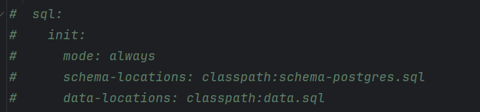

## Для запуску CRM системи потрібно:

- Запустити docker-compose.yml файл;
- Після успішного запуску docker-compose.yml файлу, перейти в клас CrmForBotApplication і запустити сервер;
- Після успішного запуску сервера, відкрити проект frontend-crm-for-bot, відкрити terminal перейти в папку cd stat-frontend і виконати команду npm run dev.

## Щоб виконати скрипти для створення таблиць і їх наповнення в базі даних потрібно:

- У файлі application.yml розкоментувати ось цей фрагмент 
  